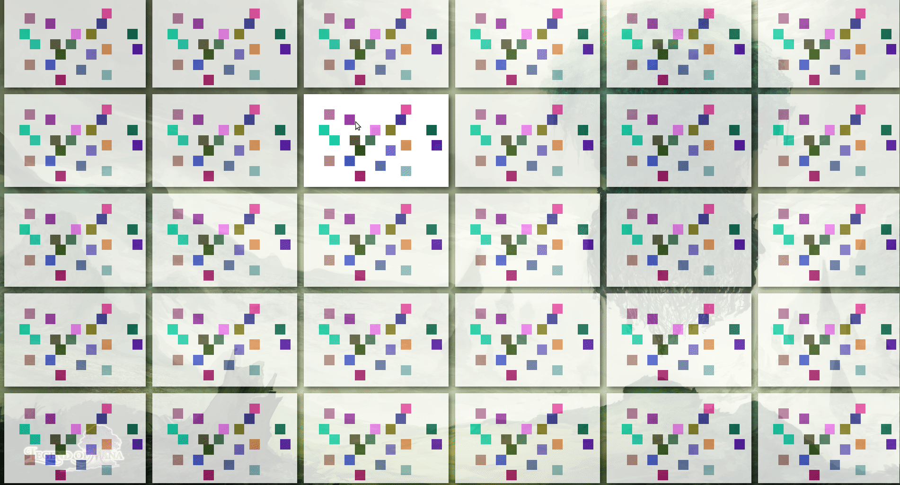

# Netcarrier

This is a network library for the ECS [shipyard](https://github.com/leudz/shipyard).

# Discontinued

This was a proof of concept for automatic generating an State that holds all the networked entities and components.
It was using macros to generate and struct with all the data. But was hard to mantain and complicated to expand.
This was replaced with some boilerplate code but easier to mantain in the [Wizardfall](https://github.com/lucaspoffo/wizardfall) game, at the [network](https://github.com/lucaspoffo/wizardfall/blob/master/shared/src/network.rs) module. In the future the wizardfall code may be isolated into an library. 

# Demo

